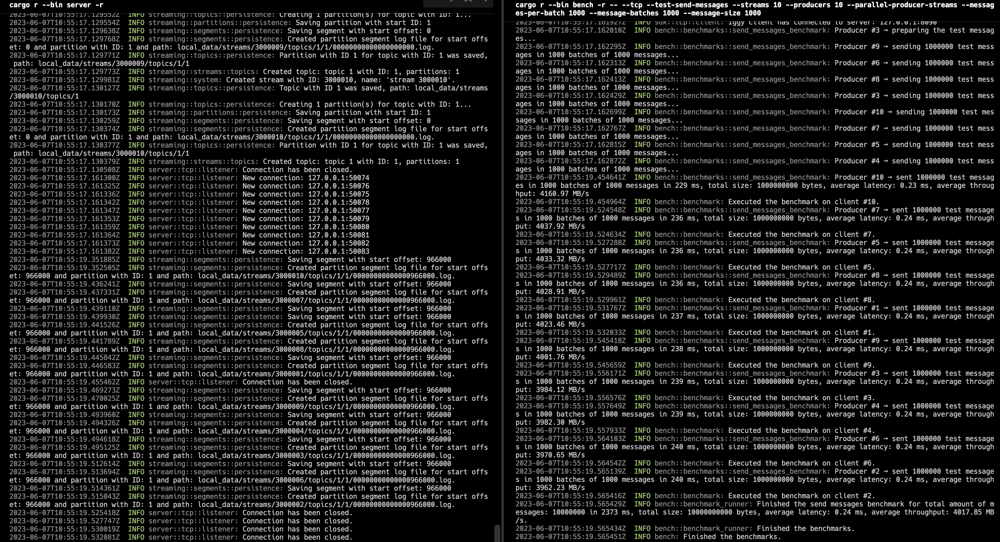
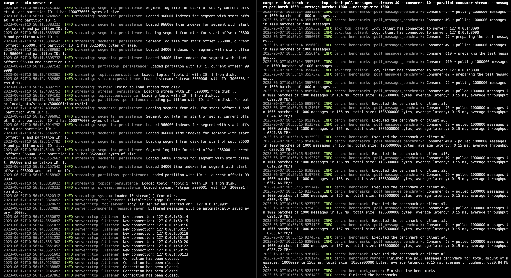

# Iggy

[Website](https://iggy.rs) | [Getting started](https://docs.iggy.rs/introduction/getting-started/) | [Documentation](https://docs.iggy.rs) | [Discord](https://iggy.rs/discord) | [Crates](https://crates.io/crates/iggy)

---

---

**Iggy** is the persistent message streaming platform written in Rust, supporting [QUIC](https://www.chromium.org/quic/), TCP (custom binary specification) and HTTP (regular REST API) transport protocols. Currently, running as a single server, it allows creating streams, topics, partitions and segments, and send/receive messages to/from them. The **messages are stored on disk as an append-only log**, and are persisted between restarts.

The goal of the project is to make a distributed streaming platform (running as a cluster), which will be able to scale horizontally and handle **millions of messages per second** (actually, **it's already very fast**, see the benchmarks below).

The name is an abbreviation for the Italian Greyhound - small yet extremely fast dogs, the best in their class. Just like mine lovely [Fabio & Cookie](https://www.instagram.com/fabio.and.cookie/) ❤️

---

### Features

- **Highly performant**, persistent append-only log for the message streaming
- **Very high throughput** for both writes and reads
- **Low latency and predictable resource usage** thanks to the Rust compiled language (no GC)
- Support for multiple streams, topics and partitions
- Support for **multiple transport protocols** (QUIC, TCP, HTTP)
- Fully operational RESTful API which can be optionally enabled
- Available client SDK in multiple languages
- **Works directly with the binary data** (lack of enforced schema and serialization/deserialization)
- Configurable server features (e.g. caching, segment size, data flush interval, transport protocols etc.)
- Possibility of storing the **consumer offsets** on the server
- Multiple ways of polling the messages:
  - By offset (using the indexes)
  - By timestamp (using the time indexes)
  - First/Last N messages
  - Next N messages for the specific consumer
- Possibility of **auto committing the offset** (e.g. to achieve *at-most-once* delivery)
- **Consumer groups** providing the message ordering and horizontal scaling across the connected clients
- **Message expiry** with auto deletion based on the configurable **retention policy**
- Additional features such as **server side message deduplication**
- **TLS** support for all transport protocols (TCP, QUIC, HTTPS)
- Optional server-side as well as client-side **data encryption** using AES-256-GCM
- Optional metadata support in the form of **message headers**
- Built-in **CLI** to manage the streaming server
- Built-in **benchmarking app** to test the performance
- **Single binary deployment** (no external dependencies)
- Running as a single node (no cluster support yet)

---

### Supported languages SDK (work in progress)

- [Rust](https://crates.io/crates/iggy)
- [C#](https://github.com/iggy-rs/iggy-dotnet-client)
- [Go](https://github.com/iggy-rs/iggy-go-client)
- [Node](https://github.com/iggy-rs/iggy-node-client)
---

### Web UI

There's an ongoing effort to build the administrative web UI for the server, which will allow to manage the streams, topics, partitions, messages and so on. Check the [Web UI repository](https://github.com/iggy-rs/iggy-web-ui)

---

### Docker

You can find the `Dockerfile` and `docker-compose` in the root of the repository. To build and start the server, run: `docker compose up`.

Additionally, you can run the `CLI` which is available in the running container, by executing: `docker exec -it iggy-server /cli`.

Keep in mind that running the container on the OS other than Linux, where the Docker is running in the VM, might result in the significant performance degradation.

The official image can be found [here](https://hub.docker.com/r/iggyrs/iggy), simply type `docker pull iggyrs/iggy`.

---

### Configuration

The default configuration can be found in `server.toml` (the default one) or `server.json` file in `configs` directory.

The configuration file is loaded from the current working directory, but you can specify the path to the configuration file by setting `IGGY_CONFIG_PATH` environment variable, for example `export IGGY_CONFIG_PATH=configs/server.json` (or other command depending on OS).

For the detailed documentation of the configuration file, please refer to the [configuration](https://docs.iggy.rs/server/configuration) section.

---

### Quick start

Build the project (the longer compilation time is due to [LTO](https://doc.rust-lang.org/rustc/linker-plugin-lto.html) enabled in release [profile](https://github.com/spetz/iggy/blob/master/Cargo.toml#L2)):

`cargo build -r`

Run the tests:

`cargo test`

Start the server:

`cargo r --bin iggy-server -r`

Start the CLI (transports: `quic`, `tcp`, `http`):

`cargo r --bin iggy-cli -r -- --transport tcp`

Create a stream with ID 1 named `dev`:

`stream.create|1|dev`

List available streams:

`stream.list`

Get stream details (ID 1):

`stream.get|1`

Create a topic for stream `dev` (ID 1), with ID 1, 2 partitions (IDs 1 and 2), disabled message expiry (0 seconds), named `sample`:

`topic.create|1|1|2|0|sample`

List available topics for stream `dev` (ID 1):

`topic.list|1`

Get topic details (ID 1) for stream `dev` (ID 1):

`topic.get|1|1`

Send a message 'hello world' (ID 1) to the stream `dev` (ID 1) to topic `sample` (ID 1) and partition 1:

`message.send|1|1|p|1|1|hello world`

Send another message 'lorem ipsum' (ID 2) to the same stream, topic and partition:

`message.send|1|1|p|1|2|lorem ipsum`

Poll messages by a regular consumer `c` (`g` for consumer group) with ID 0 from the stream `dev` (ID 1) for topic `sample` (ID 1) and partition with ID 1, starting with offset (`o`) 0, messages count 2, without auto commit (`n`) (storing consumer offset on server) and using string format `s` to render messages payload:

`message.poll|c|0|1|1|1|o|0|2|n|s`

Finally, restart the server to see it is able to load the persisted data.

The HTTP API endpoints can be found in [server.http](https://github.com/spetz/iggy/blob/master/server/server.http) file, which can be used with [REST Client](https://marketplace.visualstudio.com/items?itemName=humao.rest-client) extension for VS Code.

To see the detailed logs from the CLI/server, run it with `RUST_LOG=trace` environment variable.

**See the images below**

*Files structure*

*Server start*

*CLI start*

*Server restart*

---

### Samples

You can find the sample consumer & producer applications under `samples` directory. The purpose of these apps is to showcase the usage of the client SDK. To find out more about building the applications, please refer to the [getting started](https://docs.iggy.rs/introduction/getting-started) guide.

To run the sample, first start the server with `cargo r --bin iggy-server` and then run the producer and consumer apps with `cargo r --bin message-envelope-producer-sample` and `cargo r --bin message-envelope-consumer-sample` respectively.

You might start multiple producers and consumers at the same time to see how the messages are being handled across multiple clients. Check the [Args](https://github.com/spetz/iggy/blob/master/samples/src/shared/args.rs) struct to see the available options, such as the transport protocol, stream, topic, partition, consumer ID, message size etc.

By default, the consumer will poll the messages using the `next` available offset with auto commit enabled, to store its offset on the server. With this approach, you can easily achieve at-most-once delivery.

---

### Benchmarks

To benchmark the project, first start the server and then run the benchmarking app:

`cargo r --bin iggy-bench -r -- --tcp --test-send-messages --streams 10 --producers 10 --parallel-producer-streams --messages-per-batch 1000 --message-batches 1000 --message-size 1000`

`cargo r --bin iggy-bench -r -- --tcp --test-poll-messages --streams 10 --consumers 10 --parallel-consumer-streams --messages-per-batch 1000 --message-batches 1000`

Depending on the hardware, settings in `configs/server.toml` (the default configuration) or `server.json` file, transport protocol (`quic`, `tcp` or `http`) and payload size (`messages-per-batch * message-size`) you might expect **over 4000 MB/s (e.g. 4M of 1 KB msg/sec) throughput for writes and 6000 MB/s for reads**. The current results have been achieved on Apple M1 Max with 64 GB RAM.

*Write benchmark*

*Read benchmark*

---

### TODO

#### Project

- [x] Setup workspace for different projects
- [x] Create granular components with their own behavior and logic
- [x] Define custom conventions such as error types, statuses etc.
- [x] Make use of logging and observability crates
- [x] Create the benchmarking app to test client/server performance
- [x] Implement unit tests
- [x] Implement integration tests
- [x] Implement end-to-end tests
- [x] Implement sample producer & consumer applications to showcase the real usage
- [ ] Make use of `async trait` (instead of the crate) once available in stable Rust

#### Server

- [x] Create a basic UDP server
- [x] Make use of QUIC protocol
- [x] Extend QUIC configuration with custom certificates
- [x] Create a basic HTTP server
- [x] Make use of HTTP protocol
- [x] Create a basic TCP server
- [x] Make use of TCP protocol
- [x] Add support for TLS
  [x] Add optional data encryption for server-side
- [ ] Implement user authentication & roles management
- [x] Use async runtime from tokio
- [x] Define the custom binary protocol for communication
- [x] Allow multiple clients to connect to the server
- [x] Provide configuration via terminal arguments
- [x] Provide configuration via custom configuration file
- [x] Implement the graceful shutdown

#### Client

- [x] Create a basic UDP client
- [x] Make use of QUIC protocol
- [x] Extend QUIC configuration with custom certificates
- [x] Create a basic HTTP client
- [x] Make use of HTTP protocol
- [x] Create a basic TCP client
- [x] Make use of TCP protocol
- [x] Add support for TLS
- [x] Add optional data encryption for client-side
- [x] Provide configuration via terminal arguments
- [ ] Provide configuration via custom configuration file
- [x] Communicate with the server using established binary protocol
- [x] Allow to send commands to the server via simple CLI
- [x] Parse input from the CLI & handle the received response
- [ ] Keep the history of the commands in the CLI
- [ ] Create a simple terminal UI for the client

#### SDK

- [x] Implement the QUIC SDK for the client
- [x] Implement the HTTP SDK for the client
- [x] Implement the TCP SDK for the client
- [x] Make use of the SDK in client project
- [x] Implement another SDK in C# for dotnet clients

#### Streaming

- [x] Implement basic structures such as `stream`, `topic`, `partition`, `segment` etc.
- [x] Encapsulate the logic of reading and writing to the stream
- [x] Persist the stream structure to the disk & load it on startup
- [x] Implement `Streams` consisting of multiple `Topics`
- [x] Implement `Topic` consisting of multiple `Partitions`
- [x] Implement `Partition` consisting of multiple `Segments`
- [x] Store `Stream → Topic → Partition → Segment` structures on the disk in the separate directories
- [x] Store messages on disk as append-only log using binary format
- [x] Store messages indexes and time indexes on disk for fast access
- [x] Automatically create new partition segments when the current one is full
- [x] Allow clients to create/read/delete topics
- [x] Allow clients to send messages to the specific stream, topic and partition
- [x] Allow clients to poll messages by offsets from the specific partition
- [x] Allow clients to poll messages by timestamps from the specific partition
- [x] Make use of ring buffer to cache in-memory the latest messages to allow fast access to them
- [x] Index messages by their offset to allow fast access to the specific messages
- [x] Index messages by their timestamp to allow fast access to the specific messages
- [x] Allow parallel reading/writing from/to the distinct partitions
- [x] Allow storing client offset for the specific partition
- [ ] Implement efficient message writing on disk
- [ ] Implement efficient message reading from disk
- [ ] Implement zero-copy message reading from disk → sending to network buffer
- [x] Implement optional message headers
- [x] Implement message deduplication
- [x] Implement consumer groups for message ordering & horizontal scaling
- [x] Delete old messages bases on retention policy

#### Distribution

- [ ] Implement consensus protocol for the cluster
- [ ] Implement leader election for the cluster
- [ ] Implement cluster membership protocol
- [ ] Implement cluster discovery protocol
- [ ] Implement cluster configuration protocol
- [ ] Implement cluster state replication protocol
- [ ] Implement cluster state synchronization protocol
- [ ] Implement partition replication protocol on different servers
- [ ] Allow clients to connect to the cluster

#### API

- [x] Implement REST API for the server using Axum
- [x] Expose all the routes to achieve the same functionality as with the QUIC and TCP
- [ ] Generate OpenAPI specification for the REST API

#### UI

- [x] Build a simple UI for the server using chosen framework