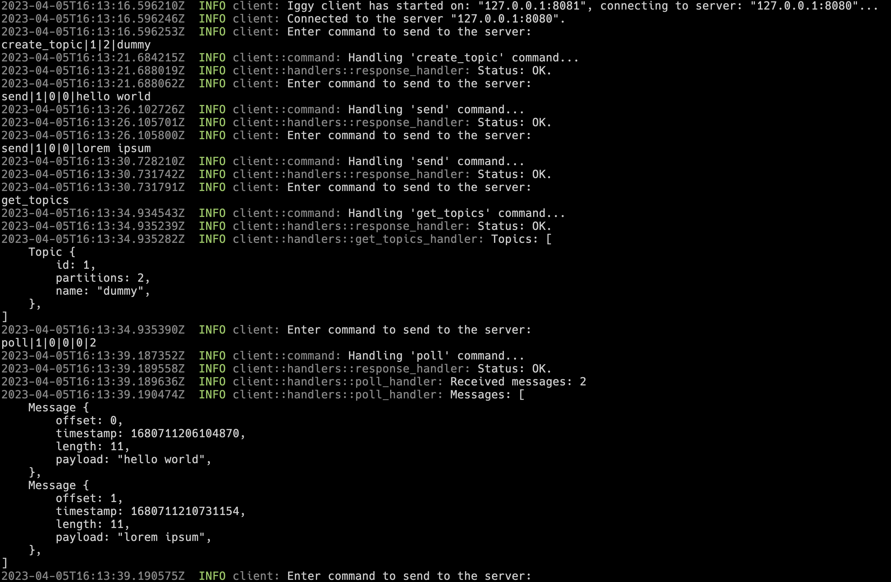

## Iggy

---

Iggy is the streaming platform written in Rust, using UDP as a transport protocol with a custom binary specification. Currently, running as a single server, it allows creating topics, partitions and segments, and send/receive messages to/from them. The messages are stored on disk as an append-only log, and are persisted between restarts.

The goal of the project is to make a distributed streaming platform (running as a cluster), which will be able to handle millions of messages per second, and will be able to scale horizontally.

It is a pet project of mine to learn more about distributed systems and Rust.

---

### Basic usage

Build the project

`cargo build`

Start the server

`cargo run --bin server`

Start the client

`cargo run --bin client`

Create a stream `dev` with ID 1

`stream.create|1|dev`

List available streams

`stream.list`

Create a topic `dummy` with ID 1 and 2 partitions (IDs 0 and 1) for stream `dev` (ID 1)

`topic.create|1|1|2|dummy`

List available topics for stream `dev` (ID 1)

`topic.list|1`

Send a message to the stream `dev` (ID 1) to topic `dummy` (ID 1) and partition 0

`message.send|1|1|0|0|hello world`

Send another message

`message.send|1|1|0|0|lorem ipsum`

Poll 2 messages from the stream `dev` (ID 1) for topic `dummy` (ID 1) and partition 0 starting with offset 0 using string format `s`

`message.poll|1|1|0|0|0|2|s`

Finally, restart the server to see it is able to load the persisted data.

**See the images below**

Files structure

Server start

Client start

Server restart

---

### Features and TODO

#### Project

- [x] Setup workspace for different projects
- [x] Create granular components with their own behavior and logic
- [x] Define custom conventions such as error types, statuses etc.
- [x] Make use of logging and observability crates
- [ ] Implement unit tests
- [ ] Implement integration and end-to-end tests

#### Server

- [x] Create a basic UDP server
- [x] Use async runtime from tokio
- [x] Define the custom binary protocol for communication
- [x] Allow multiple clients to connect to the server
- [x] Provide configuration via terminal arguments
- [x] Provide configuration via custom configuration file
- [x] Implement the graceful shutdown

#### Client

- [x] Create a basic UDP client
- [x] Provide configuration via terminal arguments
- [ ] Provide configuration via custom configuration file
- [x] Communicate with the server using established binary protocol
- [x] Allow to send commands to the server via simple CLI
- [x] Parse input from the CLI & handle the received response
- [ ] Refactor input parsing logic to the dedicated SDK project
- [ ] Keep the history of the commands in the CLI
- [ ] Create a simple terminal UI for the client

#### SDK

- [ ] Implement the basic SDK for the client
- [ ] Make use of the SDK in client project
- [ ] Implement another SDK in C# for dotnet clients

#### Streaming

- [x] Implement basic structures such as `stream`, `topic`, `partition`, `segment` etc.
- [x] Encapsulate the logic of reading and writing to the stream
- [x] Persist the stream structure to the disk & load it on startup
- [x] Implement `Streams` consisting of multiple `Topics`
- [x] Implement `Topic` consisting of multiple `Partitions`
- [x] Implement `Partition` consisting of multiple `Segments`
- [x] Store `Topic → Partition → Segment` structures on the disk in separate directories
- [x] Store messages on disk as append-only log using binary format
- [x] Store messages index + timeindex on disk for fast access
- [x] Automatically create new partition segments when the current one is full
- [x] Allow clients to create/read/delete topics
- [x] Allow clients to send messages to the specific topic and partition
- [x] Allow clients to poll messages from the specific topic and partition
- [ ] Cache in-memory only part of the latest messages to allow fast access to them
- [ ] Index messages by their offset to allow fast access to the specific messages
- [ ] Index messages by their timestamp to allow fast access to the specific messages
- [ ] Implement efficient message writing on disk
- [ ] Implement efficient message reading from disk
- [ ] Implement zero-copy message reading from disk → sending to network buffer

#### Distribution

- [ ] Implement consensus protocol for the cluster
- [ ] Implement leader election for the cluster
- [ ] Implement cluster membership protocol
- [ ] Implement cluster discovery protocol
- [ ] Implement cluster configuration protocol
- [ ] Implement cluster state replication protocol
- [ ] Implement cluster state synchronization protocol
- [ ] Implement partition replication protocol on different servers
- [ ] Allow clients to connect to the cluster

#### API

- [ ] Implement REST API for the server using Axum