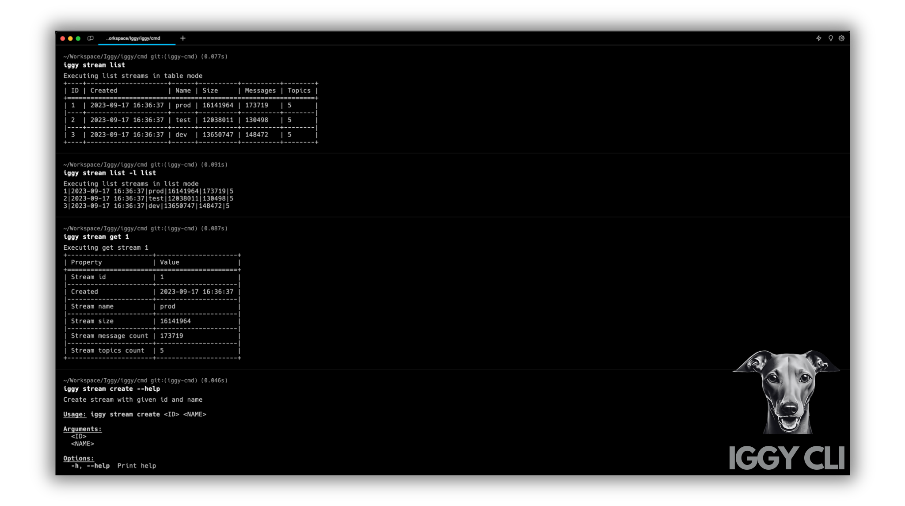
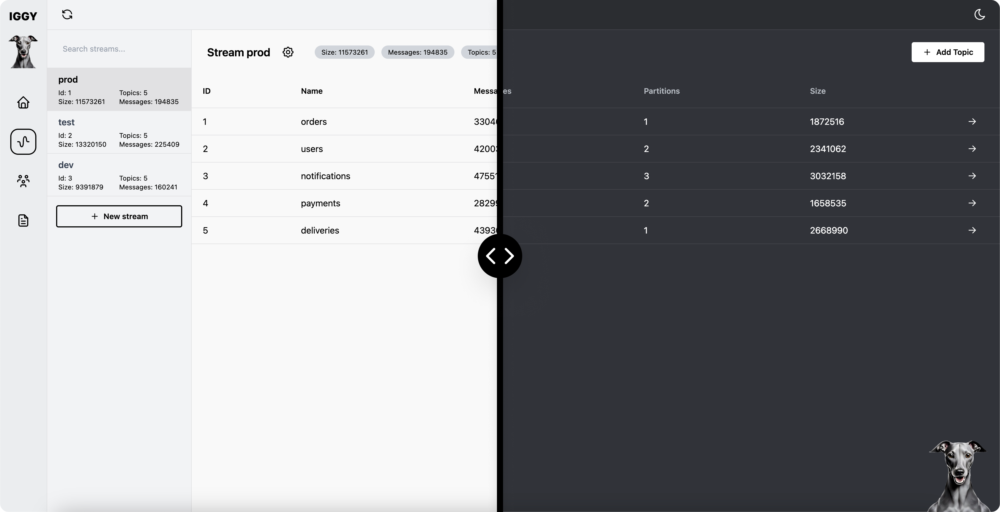
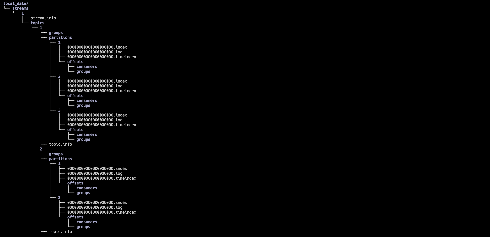
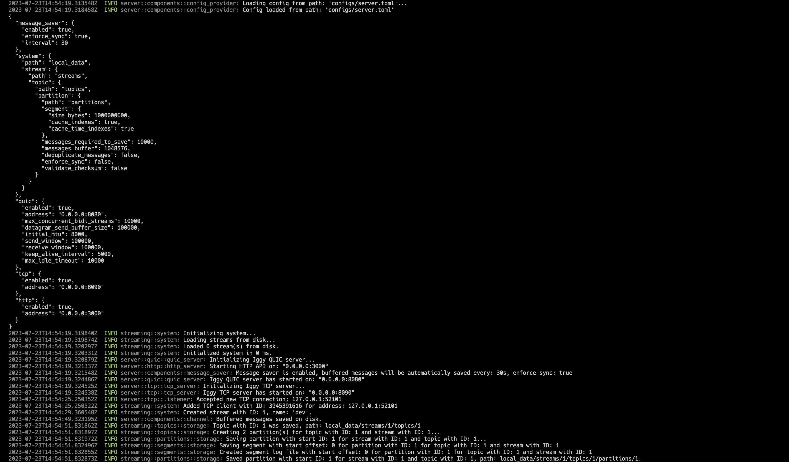
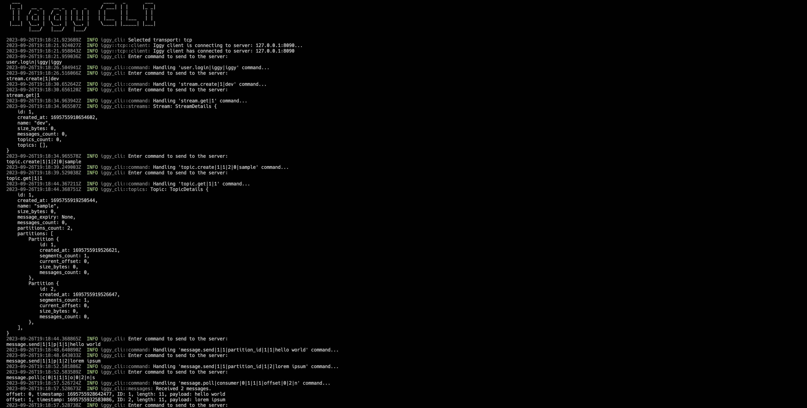
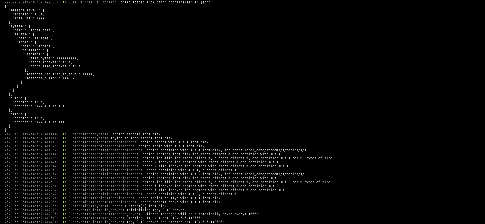
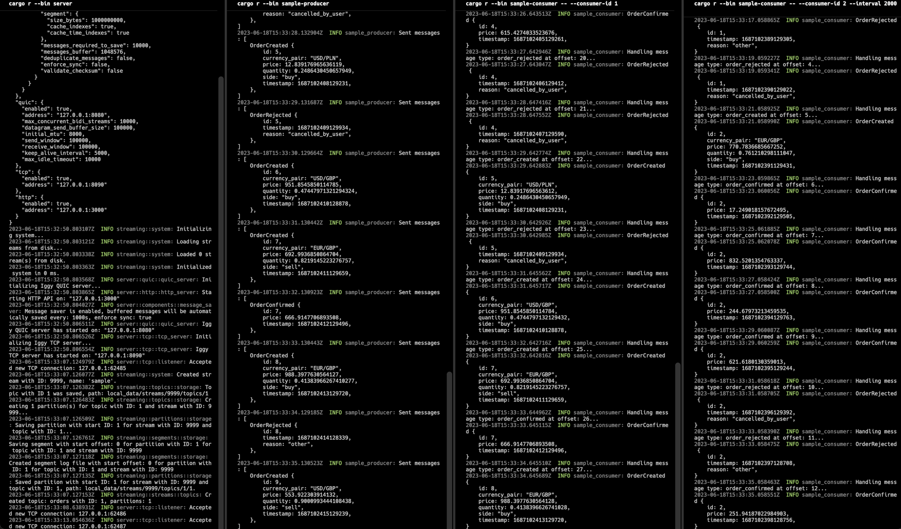

# Iggy

<div style="display: flex; flex-wrap: wrap; justify-content: center; align-items: center; text-align: center;">

  [Website](https://iggy.rs) | [Getting started](https://docs.iggy.rs/introduction/getting-started/) | [Documentation](https://docs.iggy.rs) | [Blog](https://blog.iggy.rs) | [Discord](https://iggy.rs/discord) | [Crates](https://crates.io/crates/iggy)

</div>
<div style="display: flex; flex-wrap: wrap; justify-content: center; align-items: center; text-align: center;">

  [](https://crates.io/crates/iggy)
  [](https://crates.io/crates/iggy)
  [](https://docs.rs/iggy)
  [](https://github.com/iggy-rs/iggy/actions/workflows/test.yml)
  [](https://coveralls.io/github/iggy-rs/iggy?branch=master)
  [](https://deps.rs/repo/github/iggy-rs/iggy)
  [](https://twitter.com/iggy_rs_)
   [](https://iggy.rs/discord)

</div>

---

<div align="center">

  

</div>

---

**Iggy** is the persistent message streaming platform written in Rust, supporting [QUIC](https://www.chromium.org/quic/), TCP (custom binary specification) and HTTP (regular REST API) transport protocols. Currently, running as a single server, it allows creating streams, topics, partitions and segments, and send/receive messages to/from them. The **messages are stored on disk as an append-only log**, and are persisted between restarts.

The goal of the project is to make a distributed streaming platform (running as a cluster), which will be able to scale horizontally and handle **millions of messages per second** (actually, **it's already very fast**, see the benchmarks below).

Iggy provides **exceptionally high throughput and performance** while utilizing minimal computing resources.

This is **not yet another extension** running on top of the existing infrastructure, such as Kafka or SQL database.

Iggy is the persistent message streaming log **built from the ground up** using the low lvl I/O for speed and efficiency.

The name is an abbreviation for the Italian Greyhound - small yet extremely fast dogs, the best in their class. Just like mine lovely [Fabio & Cookie](https://www.instagram.com/fabio.and.cookie/) ❤️

---

## Features

- **Highly performant**, persistent append-only log for the message streaming
- **Very high throughput** for both writes and reads
- **Low latency and predictable resource usage** thanks to the Rust compiled language (no GC)
- **Users authentication and authorization** with granular permissions and PAT (Personal Access Tokens)
- Support for multiple streams, topics and partitions
- Support for **multiple transport protocols** (QUIC, TCP, HTTP)
- Fully operational RESTful API which can be optionally enabled
- Available client SDK in multiple languages
- **Works directly with the binary data** (lack of enforced schema and serialization/deserialization)
- Configurable server features (e.g. caching, segment size, data flush interval, transport protocols etc.)
- Possibility of storing the **consumer offsets** on the server
- Multiple ways of polling the messages:
  - By offset (using the indexes)
  - By timestamp (using the time indexes)
  - First/Last N messages
  - Next N messages for the specific consumer
- Possibility of **auto committing the offset** (e.g. to achieve *at-most-once* delivery)
- **Consumer groups** providing the message ordering and horizontal scaling across the connected clients
- **Message expiry** with auto deletion based on the configurable **retention policy**
- Additional features such as **server side message deduplication**
- **TLS** support for all transport protocols (TCP, QUIC, HTTPS)
- Optional server-side as well as client-side **data encryption** using AES-256-GCM
- Optional metadata support in the form of **message headers**
- Built-in **CLI** to manage the streaming server
- Built-in **benchmarking app** to test the performance
- **Single binary deployment** (no external dependencies)
- Running as a single node (no cluster support yet)

---

## Roadmap

- Streaming server caching and I/O improvements
- Low level optimizations (zero-copy etc.)
- Clustering & data replication
- Rich console CLI
- Advanced Web UI
- Developer friendly SDK supporting multiple languages
- Plugins & extensions support

For the detailed information about current progress, please refer to the [project board](https://github.com/orgs/iggy-rs/projects/1).

---

## Supported languages SDK (work in progress)

- [Rust](https://crates.io/crates/iggy)
- [C#](https://github.com/iggy-rs/iggy-dotnet-client)
- [Go](https://github.com/iggy-rs/iggy-go-client)
- [Node](https://github.com/iggy-rs/iggy-node-client)
- [Python](https://github.com/iggy-rs/iggy-python-client)
- [Java](https://github.com/iggy-rs/iggy-java-client)
- [C++](https://github.com/iggy-rs/iggy-cpp-client)
- [Elixir](https://github.com/iggy-rs/iggy-elixir-client)

---

## CLI

The brand new, rich, interactive CLI is being implemented under the `cli` project, to provide the best developer experience. This will be a great addition to the Web UI, especially for all the developers who prefer using the console tools.



## Web UI

There's an ongoing effort to build the administrative web UI for the server, which will allow to manage the streams, topics, partitions, messages and so on. Check the [Web UI repository](https://github.com/iggy-rs/iggy-web-ui)



---

## Docker

You can find the `Dockerfile` and `docker-compose` in the root of the repository. To build and start the server, run: `docker compose up`.

Additionally, you can run the `CLI` which is available in the running container, by executing: `docker exec -it iggy-server /cli`.

Keep in mind that running the container on the OS other than Linux, where the Docker is running in the VM, might result in the significant performance degradation.

The official images can be found [here](https://hub.docker.com/r/iggyrs/iggy), simply type `docker pull iggyrs/iggy`.

---

## Configuration

The default configuration can be found in `server.toml` (the default one) or `server.json` file in `configs` directory.

The configuration file is loaded from the current working directory, but you can specify the path to the configuration file by setting `IGGY_CONFIG_PATH` environment variable, for example `export IGGY_CONFIG_PATH=configs/server.json` (or other command depending on OS).

For the detailed documentation of the configuration file, please refer to the [configuration](https://docs.iggy.rs/server/configuration) section.

---

## Quick start

Build the project (the longer compilation time is due to [LTO](https://doc.rust-lang.org/rustc/linker-plugin-lto.html) enabled in release [profile](https://github.com/spetz/iggy/blob/master/Cargo.toml#L2)):

`cargo build`

Run the tests:

`cargo test`

Start the server:

`cargo r --bin iggy-server`

*Please note that all commands below are using `iggy` binary, which is part of release (`cli` sub-crate).*

Create a stream with ID 1 named `dev` using default credentials and `tcp` transport (available transports: `quic`, `tcp`, `http`, default `tcp`):

`cargo r --bin iggy -- --transport tcp --username iggy --password iggy stream create 1 dev`

List available streams:

`cargo r --bin iggy -- --username iggy --password iggy stream list`

Get stream details (ID 1):

`cargo r --bin iggy -- -u iggy -p iggy stream get 1`

Create a topic for stream `dev` (ID 1), with ID 1, 2 partitions (IDs 1 and 2), disabled message expiry (0 seconds), named `sample`:

`cargo r --bin iggy -- -u iggy -p iggy topic create dev 1 2 sample`

List available topics for stream `dev` (ID 1):

`cargo r --bin iggy -- -u iggy -p iggy topic list dev`

Get topic details (ID 1) for stream `dev` (ID 1):

`cargo r --bin iggy -- -u iggy -p iggy topic get 1 1`

Send a message 'hello world' (ID 1) to the stream `dev` (ID 1) to topic `sample` (ID 1) and partition 1:

`cargo r --bin iggy -- -u iggy -p iggy message send --partition-id 1 dev sample "hello world"`

Send another message 'lorem ipsum' (ID 2) to the same stream, topic and partition:

`cargo r --bin iggy -- -u iggy -p iggy message send --partition-id 1 dev sample "lorem ipsum"`

Poll messages by a regular consumer with ID 1 from the stream `dev` (ID 1) for topic `sample` (ID 1) and partition with ID 1, starting with offset 0, messages count 2, without auto commit (storing consumer offset on server):

`cargo r --bin iggy -- -u iggy -p iggy message poll --consumer 1 --offset 0 --message-count 2 --auto-commit dev sample 1`

Finally, restart the server to see it is able to load the persisted data.

The HTTP API endpoints can be found in [server.http](https://github.com/spetz/iggy/blob/master/server/server.http) file, which can be used with [REST Client](https://marketplace.visualstudio.com/items?itemName=humao.rest-client) extension for VS Code.

To see the detailed logs from the CLI/server, run it with `RUST_LOG=trace` environment variable. See images below:

*Files structure*

*Server start*

*CLI start*

*Server restart*

---

## Examples

You can find the sample consumer & producer applications under `examples` directory. The purpose of these apps is to showcase the usage of the client SDK. To find out more about building the applications, please refer to the [getting started](https://docs.iggy.rs/introduction/getting-started) guide.

To run the example, first start the server with `cargo r --bin iggy-server` and then run the producer and consumer apps with `cargo r --example message-envelope-producer` and `cargo r --example message-envelope-consumer` respectively.

You might start multiple producers and consumers at the same time to see how the messages are being handled across multiple clients. Check the [Args](https://github.com/spetz/iggy/blob/master/examples/src/shared/args.rs) struct to see the available options, such as the transport protocol, stream, topic, partition, consumer ID, message size etc.

By default, the consumer will poll the messages using the `next` available offset with auto commit enabled, to store its offset on the server. With this approach, you can easily achieve *at-most-once* delivery.



---

## Benchmarks

To benchmark the project, first build the project in release mode:

```bash
cargo build --release
```

Then, run the benchmarking app with the desired options:

1. Polling (reading) benchmark

   ```bash
   cargo r --bin iggy-bench -r -- -c -v send tcp
   ```

2. Sending (writing) benchmark

   ```bash
   cargo r --bin iggy-bench -r -- -c -v poll tcp
   ```

3. Parallel sending and polling benchmark

   ```bash
   cargo r --bin iggy-bench -r -- -c -v send-and-poll tcp
   ```

These benchmarks would start the server with the default configuration, create a stream, topic and partition, and then send or poll the messages. The default configuration is optimized for the best performance, so you might want to tweak it for your needs. If you need more options, please refer to `iggy-bench` subcommands `help` and `examples`.
For example, to run the benchmark for the already started server, provide the additional argument `--server-address 0.0.0.0:8090`.

Depending on the hardware, transport protocol (`quic`, `tcp` or `http`) and payload size (`messages-per-batch * message-size`) you might expect **over 4000 MB/s (e.g. 4M of 1 KB msg/sec) throughput for writes and 6000 MB/s for reads**. These results have been achieved on Apple M1 Max with 64 GB RAM.

---
